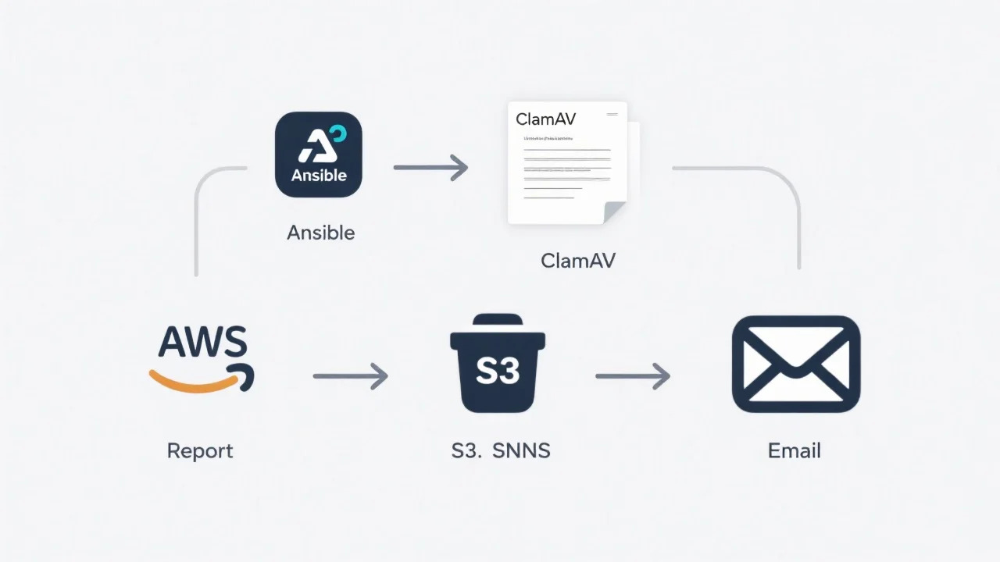

# ClamAV Scan Automático com Upload para AWS S3 e Notificação via SNS

Este projeto oferece uma solução automatizada para a verificação de vírus em servidores utilizando o ClamAV, um antivírus open-source amplamente reconhecido. Após realizar a varredura completa do sistema, o projeto gera um relatório detalhado dos arquivos escaneados e possíveis ameaças detectadas. Esse relatório é automaticamente enviado e armazenado em um bucket AWS S3, garantindo alta disponibilidade e segurança dos dados. Além disso, o sistema integra notificações via AWS SNS (Simple Notification Service), permitindo o envio instantâneo de alertas para equipes responsáveis, facilitando a resposta rápida a incidentes de segurança. Com essa automação, é possível melhorar significativamente a eficiência operacional e a proteção contra ameaças, minimizando riscos e otimizando a gestão da segurança em ambientes de TI.

---

## Funcionalidades

- Executa scan antivírus recursivo em diretórios especificados.
- Exclui diretórios e arquivos conforme configurado.
- Envia relatório do scan para AWS S3.
- Notifica via SNS com o conteúdo do relatório (se pequeno) ou link para o arquivo no S3.
- Automatizado via Ansible, com configuração de cron para execução periódica.

---

## Pré-requisitos

- ClamAV instalado na máquina.
- AWS CLI configurado com permissões para S3 e SNS.
- Usuário AWS com credenciais ou role com permissão para upload e publicação SNS.
- Bucket S3 e tópico SNS previamente criados.

---

## Como usar

1. Configure variáveis no playbook Ansible (`scan_directory`, `exclude_directories`, `exclude_files`, `s3_bucket`, `sns_topic_arn`).
2. Execute o playbook para instalar, configurar e agendar o scan.
3. O script será executado no cron conforme configuração.
4. Você receberá notificações via SNS caso haja vírus detectados.

---

## Arquivos principais

- `playbook.yml` — Playbook Ansible para configurar ambiente e agendar scan.
- `clamav_s3_report.sh` — Script que executa scan, faz upload e envia notificação SNS.
- `README.md` — Este arquivo.

---

## Contato

Paulo Ricássio  
[GitHub](https://github.com/pauloricassio)  
Email: ricassio@media4all.com.br

---

## Licença

Este projeto está sob a licença MIT. Veja o arquivo LICENSE para mais detalhes.

